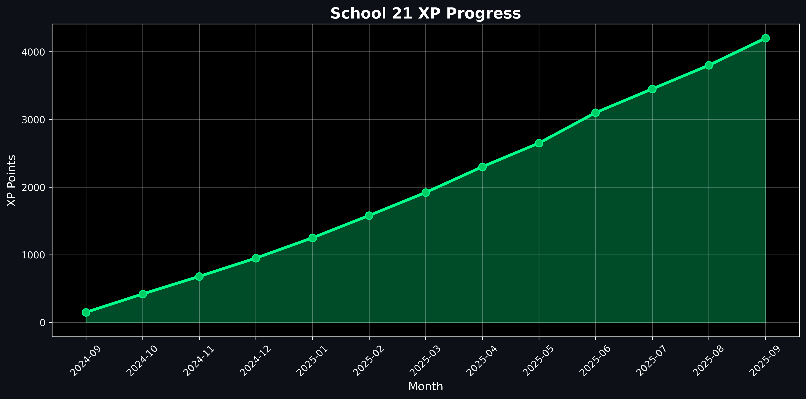
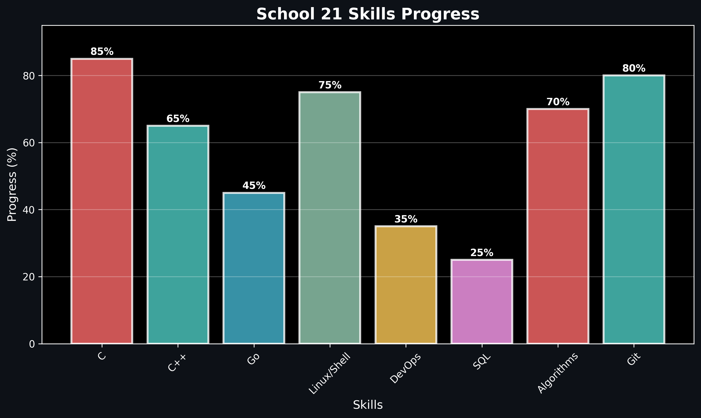

<h1 align="center">
  
  𝐇𝐞𝐥𝐥𝐨, &lt;𝚌𝚘𝚍𝚎𝚛𝚜/&gt;!
  
</h1>

 
 

- 🔭 𝙸'𝚖 𝚌𝚞𝚛𝚛𝚎𝚗𝚝𝚕𝚢 **learning C → C++ → GoLang**
- 🌱 𝙸'𝚖 **exploring Linux, Shell/Bash, and DevOps practices**
- 🗄️ 𝙻𝚎𝚊𝚛𝚗𝚒𝚗𝚐 **SQL and working with databases**
- 📚 𝚂𝚝𝚞𝚍𝚢𝚒𝚗𝚐 **algorithms, structured programming, and analytics**
- 🤝 𝙿𝚛𝚊𝚌𝚝𝚒𝚌𝚒𝚗𝚐 **teamwork and code review**
- ✈️ 𝙿𝚊𝚜𝚜𝚒𝚘𝚗𝚊𝚝𝚎 **about drones, fintech, and automation**
- 💬 𝙰𝚜𝚔 𝙼𝚎 𝙰𝚋𝚘𝚞𝚝 **𝙲/𝙲++, 𝙶𝚘, 𝙻𝚒𝚗𝚞𝚡, 𝚊𝚗𝚍 𝚂𝚌𝚑𝚘𝚘𝚕 𝟸𝟷!**

 
 

**𝙻𝙰𝙽𝙶𝚄𝙰𝙶𝙴𝚂 𝙰𝙽𝙳 𝚃𝙾𝙾𝙻𝚂:**  

 
 

<code></code>
<code></code>
<code></code>
<code></code>
<code></code>
<code></code>

#

<code></code>
<code></code>
<code></code>
<code></code>

 

#

## 🎓 School 21 Dashboard (auto-generated charts)

### 📈 XP Progress

### 🛠 Skills

**Key areas:**  
`C / C++` · `GoLang` · `Linux` · `Shell/Bash` · `DevOps` · `SQL` · `Algorithms` · `Structured Programming`

### 🏆 School 21 Achievements

#### 🎓 Academic Activities

  
  

#### 📚 Educational Progress

  
  
  

#### 🤝 Social Activities
### 🏆 School 21 Achievements

#### 🎓 Academic Activities

  
  

  <strong>Encourager</strong> • <strong>Such a listener</strong>

#### 📚 Educational Progress

  
  
  

  <strong>Welcome on board</strong> • <strong>Real programmer</strong> • <strong>Perfectionist</strong>

#### 🤝 Social Activities

  

  <strong>Tournament event аква 2-1</strong>

#

  <g-emoji class="g-emoji" alias="chart_with_upwards_trend" fallback-src="https://github.githubassets.com/images/icons/emoji/unicode/1f4c8.png">📈</g-emoji>
  <strong>𝙶𝚒𝚝𝚑𝚞𝚋 𝚂𝚝𝚊𝚝𝚜 in future : </strong>

